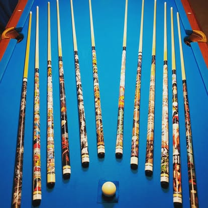

# FahCues — Custom Billiard Cues by Travis Kloss 🎱⚡

[](https://github.com/St0lenThunda/FahCues/actions/workflows/deploy.yml)
[](https://st0lenthunda.github.io/FahCues/)
[](https://www.typescriptlang.org/)
[](https://vitejs.dev/)

> **"Handcrafted Weapons of Precision with Comic Book Attitude."**

---

## 🌐 Live Website & Links

- 🎱 **Official Live Website**: **[https://st0lenthunda.github.io/FahCues/](https://st0lenthunda.github.io/FahCues/)**
- 📦 **GitHub Source Code**: **[https://github.com/St0lenThunda/FahCues](https://github.com/St0lenThunda/FahCues)**

---

A dynamic, high-voltage comic-book styled web showcase and interactive cue customizer for master cue craftsman **Travis Kloss**.



---

## ⚡ Core Features

- **Comic Book Pop-Art Aesthetic**: Halftone Ben-Day dot textures, action sound bursts (POW! CRACK!), angled comic panels, bold ink drop shadows, and vivid neon-pop palettes.
- **The Cue Arsenal (Interactive Gallery)**: Filterable showcase highlighting Travis's signature custom creations:
  - *The Punisher War Journal* (Full vintage comic decoupaged cue)
  - *The Jedi Master* (Machined Star Wars Lightsaber pool cue)
  - *The Golden Age Lineup* (Championship tournament cues)
  - *The Smokin' 8 Break Cue* (Custom resin-cast 8-ball series)
  - *Exotic Inlays & Fluted Grips* (Precision wood lathe artistry)
- **Interactive Cue Inspector Modal**: High-res inspection with detailed specs (Joint pin, shaft taper, butt wood, balance point, wrap material).
- **Interactive Custom Cue Commission Estimator**: Choose custom components (cue style, joint pin, shaft material, wrap type) with live price estimation and commission request form.
- **Interactive Cue Anatomy Diagram**: Educational comic breakdown of pool cue physics and craftsmanship (Tip, ferrule, joint, forearm, wrap, butt sleeve, bumper).
- **Comic Audio Effects Engine**: Synthesized Web Audio comic hits, chalk taps, and crack sounds with instant audio mute toggle.
- **Meet The Maker Comic Strip**: The story and craftsmanship philosophy of Travis Kloss.

---

## 🛠️ Tech Stack

- **Runtime & Bundler**: [Vite](https://vitejs.dev/) + TypeScript
- **Styling**: Vanilla CSS3 (Custom Halftone SVG filters, CSS Grid comic layout, 3D card tilt physics, zero external heavy CSS frameworks)
- **Audio Engine**: Web Audio API (Zero external audio file latency)
- **Icons & Graphics**: Pure Comic SVGs & Authentic Cue Photography

---

## 🚀 Quickstart

```bash
# Install dependencies
npm install

# Start development server
npm run dev

# Run TypeScript type check
npx tsc --noEmit

# Build production bundle
npm run build
```

---

## 📜 License & Credits

- **Cue Maker**: Travis Kloss
- **Branding & Build**: FahCues
